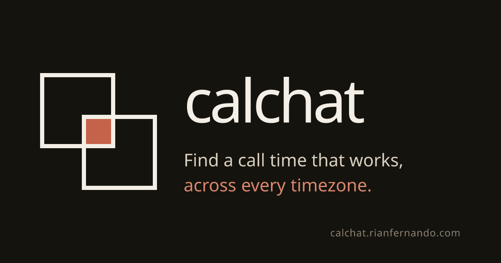

<p align="center">
  <a href="https://calchat.rianfernando.com">
    
  </a>
</p>

# CalChat

**Live: [calchat.rianfernando.com](https://calchat.rianfernando.com)** &nbsp;·&nbsp; Built by [Rian Fernando](https://rianfernando.com)

A shareable, timezone-aware availability planner. Create a link, send it to your friends
across the world, and find the hours when you're all free — at any week from now through
next year. Optimised for friend-group casual scheduling: no sign-up, no calendar import,
no integration with anything. Just a name and a colour.

---

## What it does

### Picking your availability

- **Drag-select** on a 7-day × 30-min cell grid. Each cell is 30 minutes so you can start
  on the hour *or* the half-hour (matters for friends in `Asia/Kolkata`, `Asia/Kathmandu`,
  `Australia/Adelaide`, etc.).
- **Quick-add** a day-range + time-range in one click, optionally **repeating across up to
  52 consecutive weeks** for "my Tuesdays 6–8 PM are always free" templates.
- **Personal note** per participant, attributed and editable only by you, visible to
  everyone.
- Pick one of **22 distinct rainbow colours** for your selections — the server enforces
  uniqueness, so two people can never share a colour.

### Discovering overlap

Three view modes, all in your own timezone (each visitor picks theirs independently):

- **Group overlap** — heatmap. Every cell is split into vertical stripes, one per
  participant in their colour. Filled stripe = that person is free; dim = busy.
  A green glow border highlights cells where everyone agrees.
- **Common times** — week-grid calendar with overlap **blocks positioned at their real
  times**, sized by duration. Filter by participant ("show times Rian + Wei share, ignoring
  Niharika"). Includes an *Overlaps in other weeks* panel and a **Recurring sweet-spots
  heatmap** that aggregates across all weeks to surface "Tuesday evenings work nearly every
  week."
- **My availability** — edit mode for your own selections.

### Multi-week navigation

Same link covers any week. Prev/next week, prev/next month, a custom date picker for jumps,
and a *Today* shortcut. Availability lives as absolute UTC slot indices so selections in
different weeks coexist in the same store and DST/half-hour-offset zones all align exactly.

### Multi-device + live updates

Click *"this is me"* on any participant chip to claim that entry on a new device — no
account, all browser-side. View mode auto-refreshes every 5 minutes while the tab's visible.

### The animated scene

Three.js background built with [React Three Fiber](https://r3f.docs.pmnd.rs/):

- Three concentric **timezone-dial rings** rotating against each other at different speeds,
  each marked with 24 hour ticks. A vertical heartbeat at the top of the dial softly pulses.
- **Calendar shards** — 26 translucent rectangular planes drift through 3D space, each in
  a participant-palette colour. Cursor magnetism gently pulls nearby shards toward your
  mouse.
- Every ~14 seconds, four shards drift into a column near the centre, hold briefly,
  then drift apart — a wordless metaphor for schedules locking in.
- Click anywhere off the UI to send a soft terracotta ripple.

---

## Stack

- **[Next.js 14](https://nextjs.org/)** — App Router, TypeScript, file-based metadata
- **Tailwind CSS** with a brand-driven palette (warm-dark "ink" surface, terracotta accent
  reserved for moments of overlap)
- **[React Three Fiber](https://r3f.docs.pmnd.rs/) + three.js** for the animated scene
- **[Luxon](https://moment.github.io/luxon/)** for IANA timezone handling — every IANA zone
  recognised by Node's `Intl.supportedValuesOf('timeZone')` is selectable
- **[Upstash Redis](https://upstash.com/)** for events (free tier; works directly or via
  the Vercel marketplace integration)
- **[Inter Tight](https://fonts.google.com/specimen/Inter+Tight)** + **JetBrains Mono**
  loaded with `next/font/google` as CSS variables
- **[next/og](https://nextjs.org/docs/app/api-reference/functions/image-response)** for the
  1200×630 OG card (renders the brand mark + tagline on the warm-dark surface)
- **Vercel** for hosting · **Cloudflare** for DNS (subdomain `calchat.rianfernando.com`)

---

## How the timezone math works

All availability is stored as integer **UTC 15-minute slot indices** —
`floor(epochMilliseconds / 900_000)`. Every 30-min cell in the grid maps to exactly two
consecutive slots; overlap is set intersection on the slot integers.

15 minutes is the finest granularity any real-world IANA zone uses (Nepal's
UTC+5:45 is the worst offender). So when Rian picks `Mon 8:30 PM` in `America/New_York`,
Niharika picks `Tue 6:00 AM` in `Asia/Kolkata`, and Wei picks `Tue 8:30 AM` in
`Asia/Shanghai`, the algorithm reports a **60-minute triple overlap** — each viewer sees
that same UTC window rendered in their own local time, half-hour offsets and Mon→Tue
date crossings handled exactly.

---

## Quick start (local)

```bash
npm install
cp .env.local.example .env.local   # optional — without it, data is in-memory
npm run dev
```

Open [http://localhost:3000](http://localhost:3000).

> Without env vars set, `lib/redis.ts` falls back to an **in-memory store** so you can
> exercise the flow locally — data is lost on restart and is per-instance, so it's not
> suitable for sharing.

---

## Deploying your own copy

### Database — Upstash via Vercel marketplace (recommended)

After your first Vercel deploy, on your project page go to **Storage → Create Database →
Upstash for Redis (KV)**, pick a region close to your users, free tier, then **Connect to
Project**. Vercel injects the env vars automatically.

The marketplace integration creates variables like `UPSTASH_REDIS_REST_KV_REST_API_URL`
(prefix + Vercel's standard suffix). `lib/redis.ts` recognises these along with several
other common names — see the `pickEnv(...)` chain — so it works regardless of which
prefix you typed during setup.

### Database — direct Upstash signup

1. Sign up at [upstash.com](https://upstash.com) and create a Redis database.
2. Copy the **REST URL** and **REST Token**.
3. Drop them in `.env.local` (locally) or your Vercel project env vars:
   ```
   UPSTASH_REDIS_REST_URL=https://...upstash.io
   UPSTASH_REDIS_REST_TOKEN=...
   ```

### Deploy

```bash
npm install -g vercel
vercel login
vercel --prod
```

That gives you a `*.vercel.app` URL. Add a custom domain through your DNS provider
(Cloudflare in our case — a single `A` record pointing `calchat` at `76.76.21.21`, or the
CNAME Vercel recommends).

### Verifying persistence

A diagnostic endpoint at `/api/health` performs a real Redis SET+GET round-trip and
reports `persistentStore: connected` or `in-memory fallback`. Useful when the integration's
env var names don't match what the code expects.

---

## Project layout

```
app/
  layout.tsx                     — root layout, Inter Tight + JetBrains Mono via next/font
  page.tsx                       — landing / create event
  globals.css                    — brand tokens, stacking, click-ripple keyframes
  sitemap.ts, robots.ts          — SEO surfaces
  opengraph-image.tsx            — 1200×630 OG card via next/og (edge runtime)
  event/[id]/page.tsx            — main event UI; orchestrates the three modes
  api/
    events/route.ts                                  — POST create event
    events/[id]/route.ts                             — GET event
    events/[id]/participants/route.ts                — PUT upsert participant
    health/route.ts                                  — Redis connection diagnostic

components/
  AvailabilityGrid.tsx           — 7-day × 48-cell grid; edit + view modes; touch-action
                                   locked in edit mode so phones can drag-select
  CommonTimesCalendar.tsx        — week-grid calendar of overlap blocks + filters
  WeeklyPatternHeatmap.tsx       — recurring sweet-spots view (day × hour, all weeks)
  WeekNavigator.tsx              — prev/next week + month/year jump + Today
  DatePicker.tsx                 — custom dark-theme picker, portaled to body
  QuickAdd.tsx                   — bulk day-range + time-range, repeats N weeks
  ColorPicker.tsx                — 22-swatch palette with taken-indicator
  OnboardingDialog.tsx           — name + TZ + colour on first visit; "Continue as X"
  ParticipantList.tsx            — colored chip list + "this is me" claim
  ParticipantFilter.tsx          — multi-select dropdown for Common-times view
  NotesBoard.tsx                 — per-participant notes (editable only by author)
  HoverDetails.tsx               — per-cell who's-free panel
  TimezonePicker.tsx             — searchable IANA zone picker
  ShareBar.tsx                   — copyable URL bar
  ThreeBackground.tsx            — timezone dials + calendar shards + cursor magnetism

lib/
  redis.ts                       — Upstash client with multi-env-name detection
                                   and in-memory dev fallback
  timezone.ts                    — Luxon helpers, slot math, IANA zone catalog
  overlap.ts                     — set intersection + region grouping
  colors.ts                      — 22-colour palette + uniqueness helpers
  types.ts                       — CalendarEvent / Participant types

public/brand/                    — CalChat logo lockups, favicon, apple-touch-icon
                                   (do not recolor — terracotta accent reserved for overlap)
```

---

## License

Personal project — feel free to use ideas, please don't copy the brand assets in
`public/brand/`. Built by [Rian Fernando](https://rianfernando.com).
