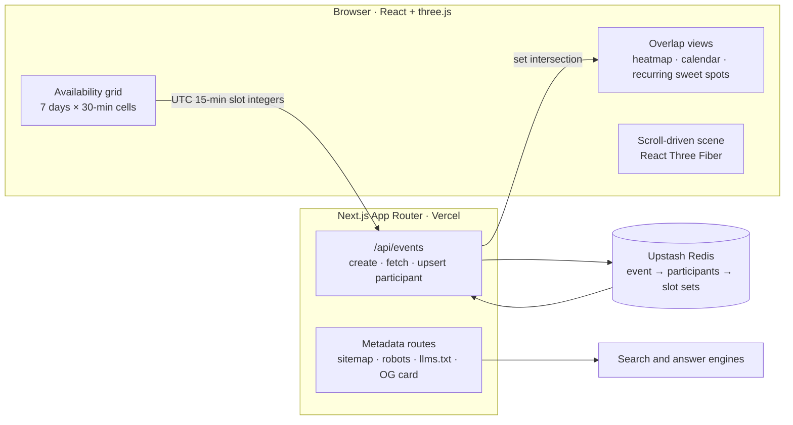

# CalChat — availability across timezones

A shareable availability planner for groups scattered across the world. One person creates a
link, everyone drags the hours they're free **in their own timezone**, and CalChat shows the
overlap — **stored as absolute UTC slots, never wall-clock time**, so daylight saving,
half-hour offsets and dates that cross midnight all resolve without special cases.

[](https://github.com/Rian-Fernando/CalChat/actions/workflows/ci.yml)
[](https://github.com/Rian-Fernando/CalChat/actions/workflows/codeql.yml)
[](LICENSE)
[](#why-its-different)
[](https://calchat.rianfernando.com)

**▶ Live: [calchat.rianfernando.com](https://calchat.rianfernando.com)** · [Project write-up](https://rianfernando.com/projects/calchat) · [llms.txt](https://calchat.rianfernando.com/llms.txt)


## Why it's different

Most group schedulers either ask you to pick from someone else's proposed slots, or want to
read your calendar. CalChat asks one question — **which hours are you actually willing to be
on a call** — which is usually a much shorter list than the hours a calendar says are
technically free. No sign-up, no OAuth, no calendar import, nothing to install.

The design decision everything else follows from: availability is **never stored as a
wall-clock time**. Every free block is an integer UTC 15-minute slot index, so finding what a
group has in common is set intersection on integers. Three people who each think they picked
a different day of the week can still be told they share a 60-minute window, and each of them
sees it rendered in their own local time.

## Architecture



Everything the group interacts with is client-side; the server does three things only — mint
an event, read one, and upsert a participant. There are no accounts to authenticate, so the
event id *is* the credential, and identity is a nanoid held in `localStorage`.

## What it does

- **Drag-select availability** — a 7-day × 30-minute cell grid. Each cell is half an hour so
  you can start on the hour *or* the half-hour, which matters for `Asia/Kolkata`,
  `Asia/Kathmandu` and `Australia/Adelaide`.
- **Quick-add with repeats** — apply a day-range and time-range in one action, optionally
  repeating across up to **52 consecutive weeks** for "my Tuesdays 6–8 PM are always free".
- **Group overlap heatmap** — every cell splits into vertical stripes, one per participant in
  their colour. Filled stripe = free, dim = busy, and a glow border marks total agreement.
- **Common-times calendar** — overlap blocks positioned at their **real times** and sized by
  duration, filterable by participant ("what works for Rian + Wei, ignoring Niharika").
- **Recurring sweet-spots** — a day × hour heatmap aggregated across every week in the event,
  surfacing "Tuesday evenings work nearly every week".
- **One link, any week** — the same URL covers every week from now through next year, with
  prev/next week, month jumps, a date picker and a *Today* shortcut.
- **22 unique colours** — the server enforces uniqueness, so no two participants can ever
  share one; that also caps an event at 22 people.
- **Per-participant notes** — attributed, visible to everyone, editable only by their author.
- **Multi-device** — click *"this is me"* on any participant chip to claim that entry on
  another device. No password. View mode re-fetches every 5 minutes while the tab is visible.

## How the timezone math works

All availability is stored as integer **UTC 15-minute slot indices** —
`floor(epochMilliseconds / 900000)`. 15 minutes is the finest granularity any real-world IANA
zone uses (Nepal's UTC+5:45 is the worst offender), so every zone lands exactly on the grid.
Each 30-minute cell maps to exactly two consecutive slots, and overlap is set intersection.

| Participant | Picks | Zone |
|---|---|---|
| Rian | Monday 8:30 PM | `America/New_York` |
| Niharika | Tuesday 6:00 AM | `Asia/Kolkata` |
| Wei | Tuesday 8:30 AM | `Asia/Shanghai` |

Three different days-of-week on three different calendars. CalChat reports a **60-minute
three-way overlap**, and each viewer sees that same UTC window in their own local time —
half-hour offsets and Mon→Tue date crossings handled exactly, with no per-zone branching.

## Stack

| Layer | Choice | Notes |
|---|---|---|
| Framework | [Next.js 14](https://nextjs.org/) | App Router, TypeScript, file-based metadata |
| Styling | Tailwind CSS | warm-dark "ink" surface; terracotta reserved for moments of overlap |
| 3D | [React Three Fiber](https://r3f.docs.pmnd.rs/) + three.js | scroll-driven scene, honours `prefers-reduced-motion` |
| Time | [Luxon](https://moment.github.io/luxon/) | every zone in `Intl.supportedValuesOf('timeZone')` is selectable |
| Store | [Upstash Redis](https://upstash.com/) | free tier; in-memory fallback when unconfigured |
| Social card | [next/og](https://nextjs.org/docs/app/api-reference/functions/image-response) | 1200×630 PNG generated at build time |
| Hosting | Vercel · Cloudflare DNS | `calchat.rianfernando.com` |

## Run it

```bash
npm install
cp .env.local.example .env.local   # optional — without it, data is in-memory
npm run dev                        # http://localhost:3000
```

Without env vars, `lib/redis.ts` falls back to an **in-memory store** so you can exercise the
whole flow locally — data is lost on restart and is per-instance, so it isn't suitable for
actually sharing a link.

For a real deployment, create an Upstash Redis database (directly, or via Vercel's
**Storage → Create Database → Upstash for Redis**) and set `UPSTASH_REDIS_REST_URL` and
`UPSTASH_REDIS_REST_TOKEN`. `lib/redis.ts` recognises several common env-var prefixes — see
the `pickEnv(...)` chain — so the Vercel marketplace integration works whatever it named
them. `/api/health` does a live SET+GET round-trip and reports `connected` or
`in-memory fallback`.

## Project structure

```
app/
  page.tsx                    landing: server-rendered copy, WebApplication + FAQPage JSON-LD
  layout.tsx                  root metadata, metadataBase, fonts
  event/[id]/                 the planner — three modes, noindex (links are private)
  api/events/                 create · fetch · upsert participant · health
  llms.txt/, robots.ts,       machine-readable surfaces for search and answer engines
    sitemap.ts, opengraph-image.tsx, apple-icon.tsx
components/
  AvailabilityGrid.tsx        7-day × 48-cell grid, drag-select, touch-locked on phones
  CommonTimesCalendar.tsx     overlap blocks at real times + participant filter
  WeeklyPatternHeatmap.tsx    recurring sweet-spots across all weeks
  ThreeBackground.tsx         timezone dials + calendar shards + scroll staging
  QuickAdd.tsx, DatePicker.tsx, TimezonePicker.tsx, ColorPicker.tsx, …
lib/
  timezone.ts                 Luxon helpers, slot math, IANA zone catalog
  overlap.ts                  set intersection + region grouping
  redis.ts                    Upstash client with multi-env-name detection + dev fallback
  colors.ts                   22-colour palette + uniqueness helpers
```

## License

[MIT](LICENSE) © Rian Fernando. The brand assets in `public/brand/` are **not** covered by the
MIT grant — please don't reuse the CalChat mark or wordmark for your own project.
